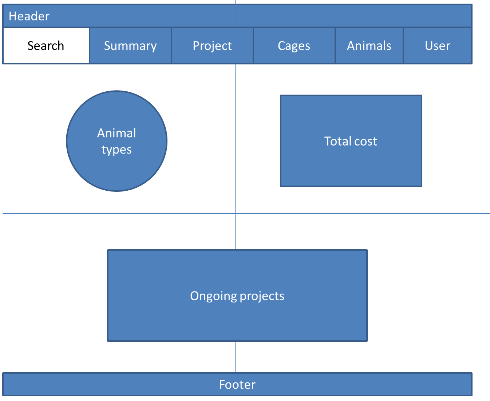
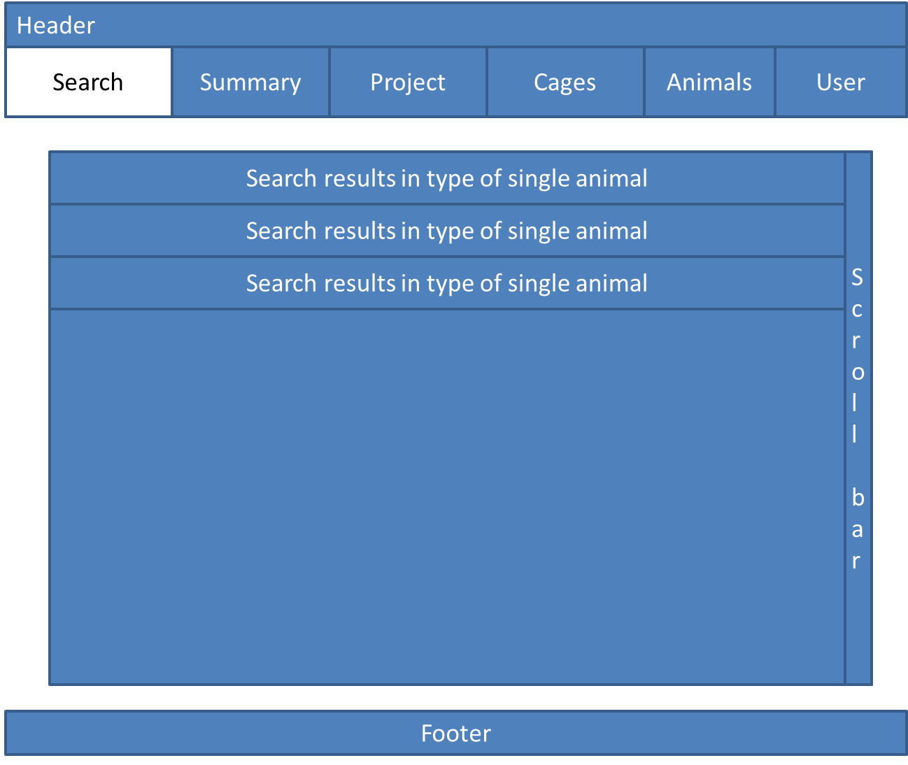
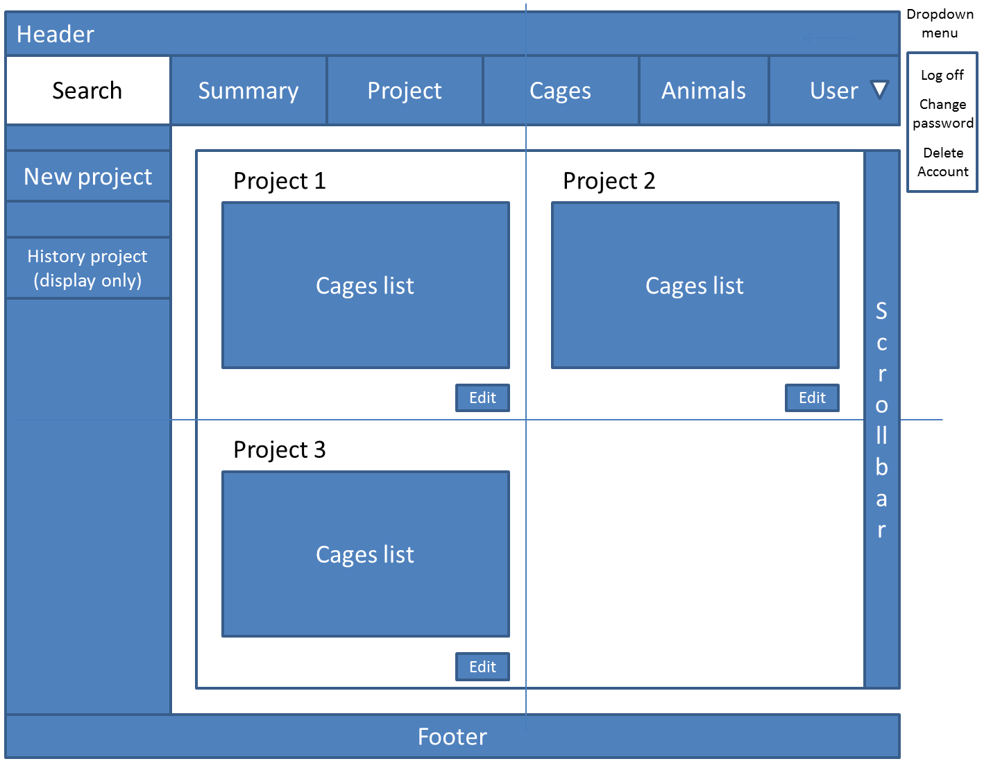
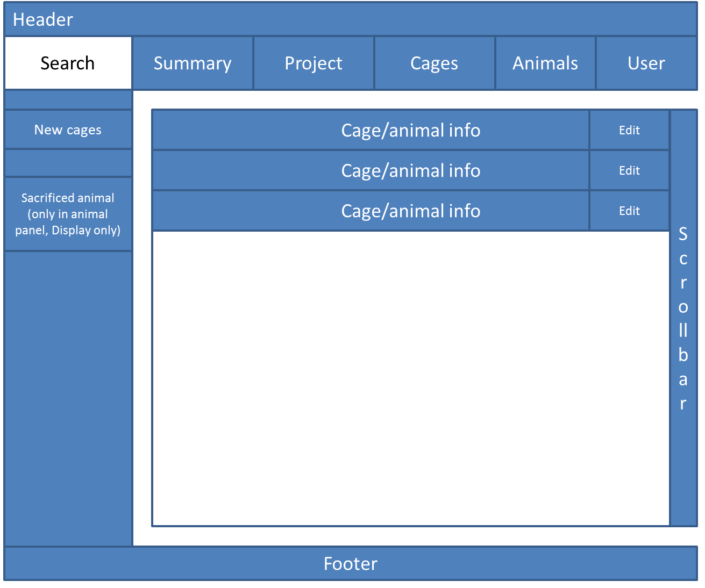
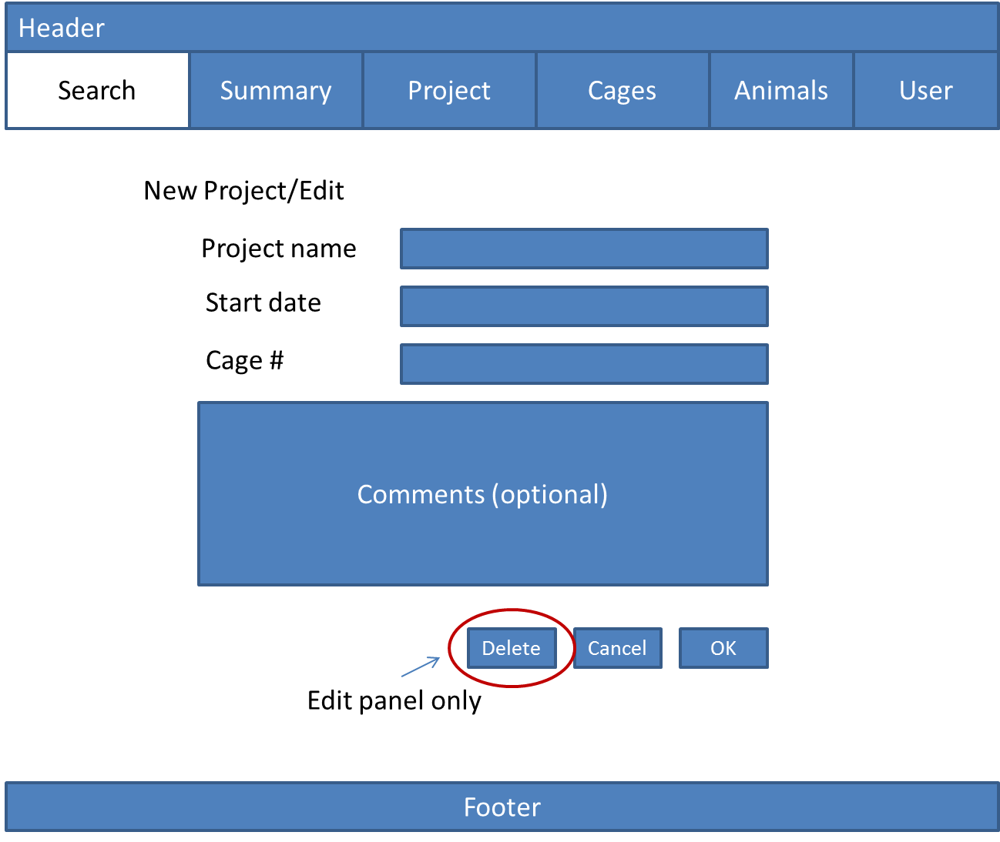
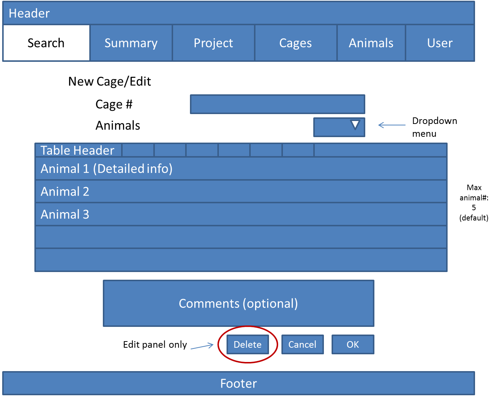

# Lab Animal Management Platform (LAMP)
Even now, the management of experimental animals in lab is still primitive and inefficient in ways from paper recording to Excel forms. These methods are hard to maintain and in short of sustainability. Different recording patterns from different researchers also make the transition painfully.

However, with the help of **LAMP**, the management of lab animals can be easy, fast and efficient. The versatility of **LAMP** make the research project progress stably and seamlessly.

## MVP
- [X] Create User Login/Sign system
- [ ] A clean and powerful UI
- [ ] User can add, delete or edit animal in cages
- [ ] Implement search function
- [ ] Support records for individual animal's id, DOB, genotype, gender etc.

## Stretch Features
- [ ] Support multiple animal species
- [ ] User can create, delete or edit projects with particular animals in cages
- [ ] User can check the ongoing or historical projects with the animals in group
- [ ] Sorting by animal id, DOB and the other conditions
- [ ] Statistical summary for total animal numbers, total cost and total projects
___
### Main Techs
- Node.js
- React.js, React-Router, Redux, React-Bootstrap
- PostgreSQL

### Project Logs
- 08/06/2018, created repository and README
- 08/07/2018
  - created user login/sign system  
  - created database
- 08/08/2018, created template for UI  
Summary &nbsp;&nbsp;Search Results&nbsp;&nbsp;Project   
Cage/Animal &nbsp;&nbsp;New Project &nbsp;&nbsp;New Cage 
- 08/09/2018, used React-Bootstrap as the framework
- 08/11/2018, encountered the biggest technical problem ever since I started this project!
  - Basically, I want to creat a table consist of multiple types of forms in rows. All forms are listened by their own event handlers. And user can add customized number of new rows. For example, after user clicked "ADD" button for 2 new rows, the table would render two more rows with the identical layout, then the user can edit the input as the other React form does.
  - However, the critical part is do decide when and how the new form-rows are created and rendered. After multiple try, finally I created a function to make a list to load the new created DOM, and call the function in multiple situations to re-render the whole table with updated value (e.g. "ADD" button-onClick; "DELETE" button-onClick)
  - In order to make that the updated value in new form-rows can be appropriately displayed, I added the related index and key name of onChanged form for React to locate the children-form which had value changed. Such function was wrapped in componentDidUpdate to make sure the render was at the right time.
